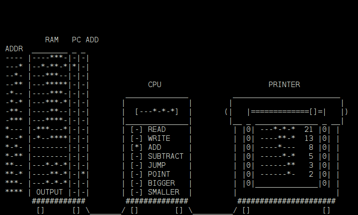

Comp
====

Simple 4-bit virtual computer with assembler



How to run on…
--------------

### Windows

1. Download and install [sbt](https://dl.bintray.com/sbt/native-packages/sbt/0.13.7/sbt-0.13.7.msi)
2. Download and extract project's [ZIP](https://github.com/gto76/comp/archive/master.zip)
3. Open command prompt, go to extracted project and execute these commands:

>```bat
setx PATH "%PATH%;C:\Program Files (x86)\sbt\bin"
sbt assembly
java -jar target/scala-2.11/wolfram-cells-assembly-0.9.0.jar 
```

### UNIX
```bash
wget http://dl.bintray.com/sbt/debian/sbt-0.13.7.deb
sudo dpkg -i sbt-0.13.7.deb
git clone https://github.com/gto76/comp.git
cd comp
sbt assembly
java -jar target/scala-2.11/comp-assembly-0.9.0.jar
```

Help
----

```
usage: comp [OPTION]... [FILE]
 -a,--assemble      Instead of execution it assembles the passed assembly
                    file.
 -h,--help          Print this message.
 -o,--only-output   Only print output.
 -s,--speed <arg>   Cycle speed in miliseconds. Default is 300
 -w,--wait          Wait for enter after every cycle.
```

Fibonacci numbers example
-------------------------

### Assembly code
```
READ v2
ADD v1
WRITE v3
WRITE a15
READ v2
WRITE v1
READ v3
WRITE v2
SMALLER a1
JUMP a15
```

### Assembly code with variables changed to absolute addresses
```
READ a14 
ADD a13
WRITE a12
WRITE a15
READ a14
WRITE a13
READ a12
WRITE a14
SMALLER a1
JUMP a15
```

All the data (values of the variables) has to be inserted in to binary manualy. Variables get adresses form the last adress backwards in order of aperance.

### Binary
```
----***-
--*-**-*
---***--
---*****
----***-
---***-*
----**--
---****-
-***---*
-*--****
--------
--------
--------
-------*
-------*
```

To execute the programm you need to run Comp.scala with path to the binary file. Binary file represents the initial state of the memory (- is 0 and * is 1). It consists of 15 lines of 8 bits.

Assembly
--------
All statements consit of istruction keyword and an address. 

#### Instructions
* READ 		`----` copy value at the address to register
* WRITE 	`---*` copy register to the adress
* ADD		`--*-` add value at the address to the register
* MINUS 	`--**` subtract value at the adress from the register 
* JUMP 		`-*--` go to adress
* POINT 	`-*-*` copy value from the address that register is pointing to into register
* BIGGER	`-**-` go to the address if register contains value, larger or equal to 127
* SMALLER	`-***` go to the address if register contains value, smaller then 127

#### Addresses are in three forms
* `a<number>`  -  absolute address 
* `<number>`   -  pointer to a value 
* `v<number>`  -  a variable
The actual computer only acepts absolute adresses. Other two options are managed by the asembler. The variables get at the end of the memory.


Binary
------

```
instructions - 4 bits
  |  +-- adresses - 4 bits
  v  v
----***-  <- 0  ----
--*-**-*  <- 1  ---*
---***--  <- 2  --*-
---*****  <- 3  --**
----***-  <- 4  -*--
---***-*  <- 5  -*-*
----**--  <- 6  -**-
---****-  <- 7  -***
-***---*  <- 8  *---
-*--****  <- 9  *--*
--------  <- 10 *-*-
--------  <- 11 *-**
--------  <- 12 **--
-------*  <- 13 **-*
-------*  <- 14 ***-
<OUTPUT>  <- 15 ****
```

* Execution starts at the first address (0). 
* Execution stops when programm reachess last adress (15)
* Output is achieved by writing to the last adress (15)
* Whatever is in the last adress (15) is considered as output and gets printed.
* Computer has one 8 bit register.


